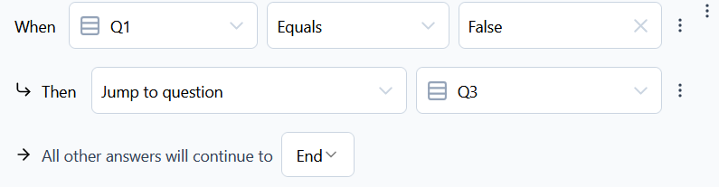
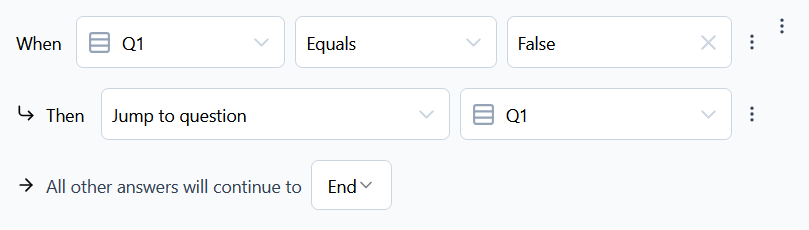

# TCL-MISC-03

> ### Odniesienia
> - [REQ-MISC-LogicEditor](../../../requirements.md#req-misc-LogicEditor)
> - [TC-MISC-06](../../high-level/misc.md#tc-misc-06)
> - [TC-MISC-07](../../high-level/misc.md#tc-misc-07)
> - [TC-MISC-08](../../high-level/misc.md#tc-misc-08)
> - [TC-MISC-09](../../high-level/misc.md#tc-misc-09)

### Cel
Przetestowanie tworzenia złożonej logiki ankiety oraz obsługi błędów w przypadku sprzecznych warunków i zmiany architektury ankiety

### Warunki wstępne:
- Użytkownik posiada aktywne konto w aplikacji Formbricks. 
- Została stworzona ankieta z 3 pytaniami typu single-select, nazwanymi "Q1", "Q2", "Q3" oraz z ending card "End". Każe pytanie ma do wyboru opcję True lub False.
- Użytkownik znajduje się na ekranie edycji powyższej ankiety.

### Kroki testowe:
  1. Dodanie bloku logicznego
       1. Rozwiń zaawansowane ustawienia ankiety - przycisk "Show Advanced settings".
       2. Kliknij przycisk "Add logic +".

  2. Dodanie warunków logicznych
       1. Utwórz warunki logiczne zgodnie z `Input`.

  3. Sprawdź czy `Expected`.

### Input/Output

| Test case | Input | Expected |
| ---       | ------      |    ---   |
TCL-MISC-03-01 | Q1: Q2:  | Niezależnie od wyboru odpowiedzi w Q1 i Q2, pytanie Q3 będzie nieosiągalne |
TCL-MISC-03-02 | Q1: | Niezależnie od wyboru odpowiedzi w Q1, pytania Q2 i Q3 będą nieosiągalne |
TCL-MISC-03-03 | Q1:  Q2:  Q3:  | System wyświetli komunikat o zapętlonych pytaniach |
TCL-MISC-03-04 | 1. Wejdź w ekran edycji ankiety z przypadku TCL-MISC-03-01  2. Zmień typ pytania Q1: | System wyświetli komunikat o możliwym spowodowaniu błędów w logice kolejnych pytań |
TCL-MISC-03-05 | 1. Wejdź w ekran edycji ankiety z przypadku TCL-MISC-03-01  2. Usuń pytanie Q1 | System wyświetli komunikat o możliwym spowodowaniu błędów w logice kolejnych pytań |
