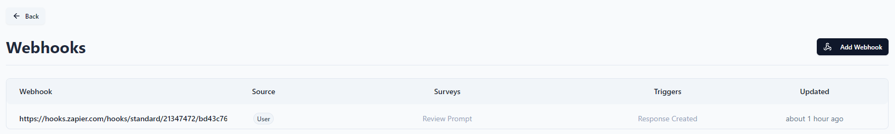
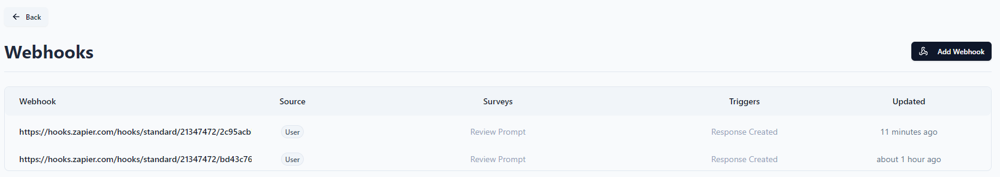

# TCL-INT-11 (Webhook Management)
> ### Odniesienia
> - [REQ-INT-Webhook](https://github.com/KWAK-testing/Formbricks-tests/blob/main/docs/requirements.md#req-int-webhooks)
> - [TC-INT-11](https://github.com/KWAK-testing/Formbricks-tests/blob/main/docs/test-cases/high-level/integrations.md#tc-int-11)

# Status: ❌
Zweryfikować proces dodawania i zarządzania webhookami.

## Wykryte defekty

### ❌ Serwisy zewnętrzne oraz formbricks nie śledzą wzajemnego stanu webhooków (na bazie Zapier)

### Reprodukcja defektu
- Zintegruj serwis Zapier z Formbricksem
- Stwórz nowego Zapsa bazującego na webhookach Formbricksa
- Dezaktywuj oraz ponownie aktywuj Zaps

### Rezultat:
Można zauważyć, że stare nieaktualne webhooki są dalej dodane na Formbricksie.

### Oczekiwany wynik:
Formbricks dostaje informację o dezaktywowaniu webhooka i usuwa go z listy.

## Dodatkowe uwagi
- ✅ webhooki zostały poprawnie dodane przez zewnętrzny serwis (Zapier).
- ✅ webhooki zostały poprawnie wygenerowane podczas integracji z zewnętrznym serwisem (Zapier).
- ✅ ręczne dodanie webhooka zgodnie z danymi z serwisu zewnętrznego przynosi porządany rezultat.

## Wersja
Cloud
