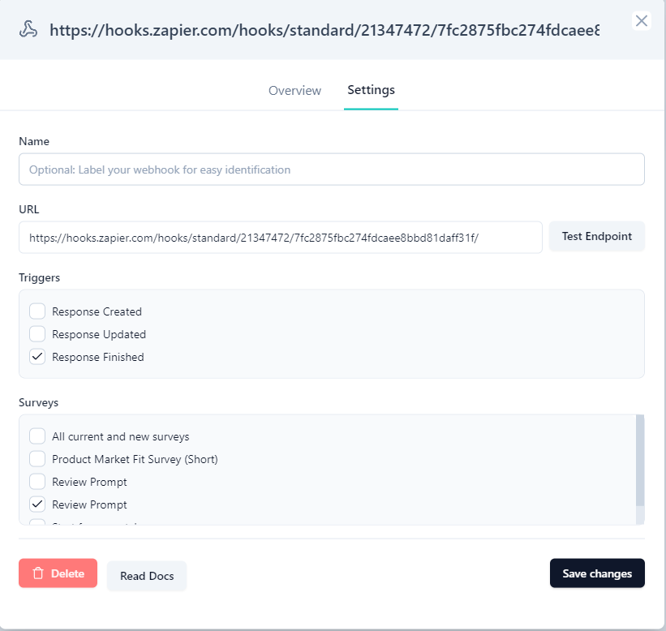
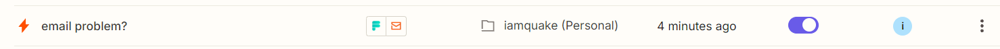

# TCL-INT-08 (Zapier Integration)
> ### Odniesienia
> - [REQ-INT-Zapier](https://github.com/KWAK-testing/Formbricks-tests/blob/main/docs/requirements.md#req-int-zapier)
> - [TC-INT-08](https://github.com/KWAK-testing/Formbricks-tests/blob/main/docs/test-cases/high-level/integrations.md#tc-int-08)

# Status: ❌
Zweryfikować poprawność działania integracji z Zapier oraz zgodność z wymogami OWASP ASVS.

## Wykryte defekty

### ❌ Zapier oraz formbricks nie śledzą wzajemnego stanu webhooków

### Reprodukcja defektu
- Zintegruj serwis Zapier z Formbricksem
- Stwórz nowego Zapsa bazującego na webhookach Formbricksa
- Usuń z poziomu formbricks webhook
- Uzupełnij ankietę

### Rezultat:
Z poziomu Zapier brak informacji o przerwaniu działania. Zaps wydaje się dalej aktywny ale nie ma żadnych efektów jego działania. Brak informacji o errorach w Zaps History.

### Oczekiwany wynik:
Stosowna informacja w Zaps History o nieaktywnym webhooku. Przejście Zapsa w stan deaktywacji. Być może rozwiązaniem byłyby regularne testy stanu dostępności webhooka / end-pointa, w tej chwili nie mogą one wiedzieć o działaniach wykonanych po drugiej stronie.

## Dodatkowe uwagi
- TBD - Przetestuj różne formaty danych w triggerach
- TBD - Sprawdź limity przepustowości i kolejkowanie
- ✅ - nie wykryto błędów podczas zmiany API
- ✅ - nie wykryto błędów w dostarczaniu danych z ankiet do Zapier i przekazywaniu ich do kolejnych serwisów

## Wersja
Cloud
